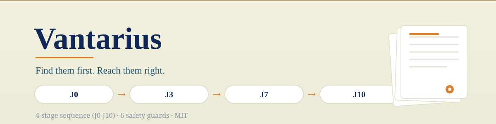

<p align="center">
  <picture>
    <source media="(prefers-color-scheme: dark)" srcset="docs/banner-dark.svg">
    
  </picture>
</p>

[](#license)
[](package.json)
[](#what-it-does)

**Find them first. Reach them right.**

Vantarius is a local LinkedIn outreach engine that reads your Excel CRM and runs a structured multi-stage prospecting sequence, powered by a local LLM (Ollama). No API keys. No cloud. Messages written by AI, sent by you (automated).

Part of the [Marius Intelligence Suite](#marius-intelligence-suite).

---

## What it does

Reads your CRM and, for each lead, runs the right step based on where they are in the sequence:

| Stage | When | Action |
|-------|------|--------|
| **J0** | New lead | Connection request + personalized note |
| **J3** | 3 days after J0 | Follow-up DM (context/proof) |
| **J7** | 7 days after J0 | Value-add DM |
| **J10** | 10 days after J0 | Clean closing message |

Each message is generated by your local LLM using the tension signal from the CRM, then validated (length, tone, CTA) before sending.

---

## Requirements

- Node.js >= 18
- [Ollama](https://ollama.com) running locally with at least one model
- A LinkedIn account (login done once via `node setup.js`)
- An Excel CRM (use [AxioMariuS](https://github.com/MariusYvard/axiomarius) to enrich it first)

---

## Setup

```bash
# 1. Install dependencies
npm install
#    Installs rebrowser-puppeteer, which patches the Runtime.Enable CDP leak
#    detected by Cloudflare and LinkedIn anti-bot systems.

# 2. Edit config.yaml (CRM path, model, quotas, message templates)

# 3. Install a model in Ollama
ollama pull gemma3:12b

# 4. Log in to LinkedIn (one-time)
node setup.js
```

---

## Usage

```bash
# Run full pipeline (all stages, respects quotas)
npm start

# Preview what would happen - nothing is sent
npm run dry-run

# Process only a specific stage
npm run j0    # New leads only
npm run j3    # J+3 follow-ups only
npm run j7    # J+7 follow-ups only
npm run j10   # Closing messages only
```

Vantarius respects daily quotas, working hours, and deduplication automatically.

---

## CRM structure

Vantarius reads from (and writes back to) your Excel file. Minimum columns:

<details>
<summary><b>Column table</b></summary>

| Column | Field | Description |
|--------|-------|-------------|
| A | Company | Company name |
| B | Stage | Pipeline stage (updated by Vantarius) |
| C | First name | Contact first name |
| G | LinkedIn URL | Profile URL |
| H | Signal | Tension signal (filled by AxioMariuS) |
| I | Date contact | Date J0 was sent |

</details>

Exact column positions are configured in `config.yaml`.

---

## Configuration

Key settings in `config.yaml`:

```yaml
llm:
  model: "gemma3:12b"
  quality_threshold: 7     # Rewrite if AI scores below this

linkedin:
  quota_per_day: 15        # Max invites per day
  delay_min: 30000         # 30s minimum between leads
  delay_max: 90000         # 90s maximum

working_hours:
  start: 9
  end: 18

messages:                  # Base templates - LLM personalizes them
  j0: "I spotted friction signals at {COMPANY}..."
```

---

## Safety features

- **Daily quota** - configurable cap on invites per day
- **Dedup guard** - never contacts the same profile twice in a day
- **Working hours** - no messages outside your configured window
- **Dry run** - preview everything before sending a single message
- **Atomic CRM save** - TEMP → BACKUP → RENAME, safe on OneDrive/Dropbox
- **CDP stealth** - uses [rebrowser-puppeteer](https://github.com/rebrowser/rebrowser-patches) to patch the `Runtime.Enable` leak exploited by Cloudflare, DataDome, and LinkedIn's bot detection

---

## Project structure

```
vantarius/
├── config.yaml               Edit this
├── setup.js                  LinkedIn login (run once)
├── src/
│   ├── main.js               Orchestrator
│   ├── llm_polisher.js       Message generation + validation
│   ├── linkedin_sender.js    Connection requests + DMs
│   ├── dedup_guard.js        Daily deduplication
│   ├── crm_writer.js         Atomic Excel write
│   ├── config_loader.js      YAML config reader
│   └── logger.js             Console + file logging
└── .github/workflows/        CI
```

---

## Marius Intelligence Suite

Vantarius and [AxioMariuS](https://github.com/MariusYvard/axiomarius) form a two-stage pipeline:

```
AxioMariuS      →      Vantarius
(OSINT)                (Outreach)
Enrich CRM      →      Read signal → generate message → send
```

They share the same CRM format and LinkedIn session directory. They can be used independently or together.

---

## License

MIT
